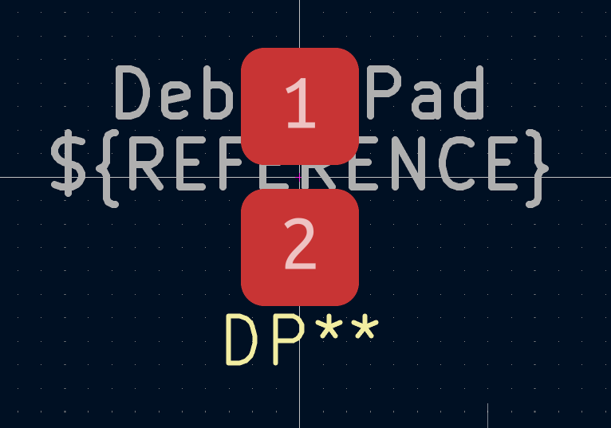
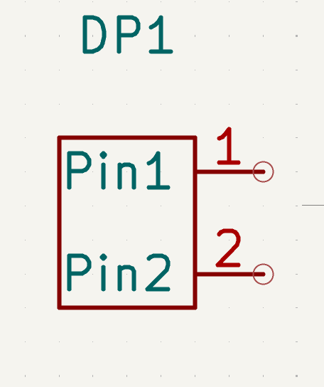

# Total Time spent: about 10 hours and 15 mins
# July 2  
I created this! 
----
# July 10 2025

Gotta start the work on the board today, will do this IN SCHOOl with the schematic.

umm okay, we are trying to make a subesat and i am incharge of making the RF board, and i have thought of using the CC1125 by Texas Instruments(my fav semiconductor manufacturer).

it is a great IC tbh and i would adapt the openlst rf design i think, because i like openlst too!

and another goal i have, to make this board as good-looking as possible.

and umm yeah, i thought let's also add the RP2040, arguably the greatest MCU ever made for it's cost. i think i might even just use the RP2350A, but i am more familiar with RP2040 so idk what am i gonna choose, i am going with rp2350A for now.

yeah, i am following the cc1125 design guide right now, and i am gonna probably complete the circuit for the cc1125 today itself.

okay yup, i worked a bit today, i think the schematic for cc1125 is complete, here is the work i did:  
  

worked a bit more, will update the progress at home

### Time Spent Today: 1h 15 mins

# July 15 2025

Okay, i found a PA for the design, but the problem is that it is not available on LCSC, it is the rffm6406, the main PA and LNA for the design, the actual frontend :/ idk what am i gonna do man 

# July 16 2025

I found a balun, [Balf-SPI2-02D3](https://www.st.com/resource/en/datasheet/balf-spi2-02d3.pdf), and along with that i found an IC, the [ST S2-LP](https://www.st.com/resource/en/datasheet/s2-lp.pdf). not sure what i am gonna use, but i am thinking i might just change the cc1125 to the new ST transceiver as it has faster data rate

nvm, i am just gonna use the cc1125 ic, it is good and i have already started the work

### Time Spent today: 15 mins
----
# July 21 2025

Today, i set out to make footprints for debug on the mian board, and i also have to make symbols:

### Time Spent Today: 15 mins

# July 22 2025

I started the work today again in school!!!
Today, i routed the Balun and now i also found an RF Switch, the [Pe4259](https://lcsc.com/product-detail/RF-Switches_pSemi-PE4259-63_C470892.html)

I also added debug pads for the board

# July 23 2025
Today, i plan to make the rf Power Amp and LNA side of the board, i am not so able to work in school too much and the rf Frontend IC in a single package is not available on lcsc so i need to find any other ic

I found an IC, this PA is [GSQ5111](https://lcsc.com/datasheet/lcsc_datasheet_2506131629_GPowerTek-GSQ5111_C41410391.pdf)

and will work on it today

gotta start working now on the schematic, i will need to make my own footprint and symbols because i cant find them for these ICs.
### Time Spent Today: 30 mins

# July 24 2025
Could not work yesterday cuz i was ill, gotta definitely start working now

okay, completed the symbol for the PA, here it is:

okay, i made a bit of footprint(it is really hard), here it is:

# July 30 2025
1 Day left until highway ends, i gotta finish my work on the schematic, and start with the layout ASAP. i cannot loose more time.
I did some work in schoool, here it is:

Now i gotta start with completing it finally

okay, i think my schematic is finally complete, i gotta start with the footprint assignment and then i'll sleep. here are a few images:

### Time Spent Today: 2 hours

# July 31 2025
Final day,I feel kind of sad today, i am in school right now, gotta complete the footprint assignment and start layout
completed assignment, and now i finished a lot of layout too:

Started with the proper routing too, will update later  
did this much:

Okay i am home, i'll be working noww
I was also told to add a UART pin on the sat bus, which i added.  
I AM REMOVING SWD IT IS VERY VERY ANNOYING AND IS INTERFERING IN LAYOUT

### Time Spent Today: 1 hour 30 mins

# August 1 2025
It is aug 1 for me, the time is 04:07 AM, my RF board is finally complete, now i just have to make BOM, take some images, write README and submit  
Bom Done
Now all the images are in README i am gonna add them here too  

okay, i have submitted it finally, and now someone spotted that i donot have CC lines grouded on USB, so i gotta do that and update EVERYTHING
### Time Spent today: 4.5 hours